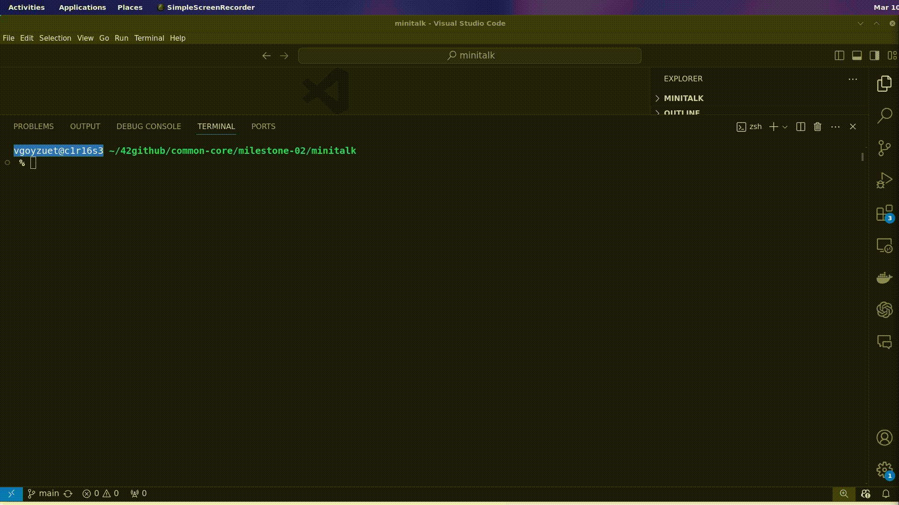

# minitalk

# Objetivo general de `minitalk`

- **Debes crear un programa de comunicación en la forma de un `client` y un `server`.**
- El `server` debe lanzarse primero y mostrar su `PID` al inicio.
- El `client` recibirá como parámetros:
  - El `PID` del servidor.
  - La `string` que debe enviarse.
- El `client` debe comunicar la `string` al `server`. Una vez recibida, el `server` debe mostrarla.
- El `server` debe ser capaz de recibir strings de distintos `client` consecutivamente sin necesidad de reiniciarse.
- La comunicación entre `client` y `server` debe hacerse **exclusivamente** utilizando señales `UNIX`.
- Solo puedes utilizar estas dos señales: `SIGUSR1` y `SIGUSR2`.
- Puedes utilizar una variable global por programa (una para el `client` y otra para el `server`).

## **Bonus**

- El `server` confirma cada señal recibida enviando una señal de respuesta al `client`.
- Soporta los caracteres `Unicode`.

---

## **`server`**

1. **Ejecución del `server`**
    - Obtiene su propio `PID` y lo muestra en la `consola`.
    - Configura el `server_signal_handler` para interrupciones de `UNIX signals`.
    - Se mantiene en `sleep` mientras espera señales de `client`.
2. **Recepción de `REQUEST_REPLY` desde el `client`**
    - `siginfo_t *info` recibe automáticamente el `pid` del `client` y lo asigna a `info->si_pid`.
    - Se gestiona la posible pérdida de señales con `lost_signal`.
    - Se almacena el `client_pid` en `g_client.clientpid`.
    - Si no hay otro proceso activo (`g_client.current_pid`), el `server` responde con `SERVER_READY`.
3. **Recepción de `len` de `message` bit a bit**
    - Se posicionan los bits hasta obtener el `len` de `message` en `BYTE_4`.
    - Se muestra el `len` en consola y se asigna memoria para el mensaje.
4. **Recepción de `char *message` bit a bit**
    - Se recibe cada `bit` hasta completar cada `BYTE`, reconstruyendo el `char *message`.
    - Al finalizar, se muestra la `char *message`, se libera memoria y se reinician las estructuras.
5. **Proceso completado.** El `server` vuelve al bucle `sleep` esperando nuevas `UNIX signals`.

---

## **`client`**

1. **Ejecución del `client`**
    - Recibe los argumentos:
      - `ARGV[1]`: `server_pid`.
      - `ARGV[2]`: `char *message`.
    - Valida los argumentos.
    - Inicializa `t_info client` con sus atributos (`server_pid`, `client_pid`, `message`).
    - Envia `REQUEST_REPLY` al `server` y espera respuesta.
2. **Recepción de `SERVER_READY` desde el `server`**
    - Se confirma que `siginfo_t *info` proviene del `server_pid`.
    - Se cambia la `flag` `g_server.is_ready` a `1`.
3. **Envío de `len` de `message` bit a bit (`send_message_bits`)**
    - Se convierte `len` en su representación binaria y se envía bit a bit.
    - Cada comparación con `1ULL` determina si se envía `SIGUSR1` o `SIGUSR2`.
4. **Envío de `char *message` bit a bit (`send_message_content`)**
    - Se procesa cada `char` en binario para `BYTE`.
    - Se espera confirmación (`SIGNAL_RECEIVED`) del `server` por cada bit enviado.
5. **Proceso completado.**

---

